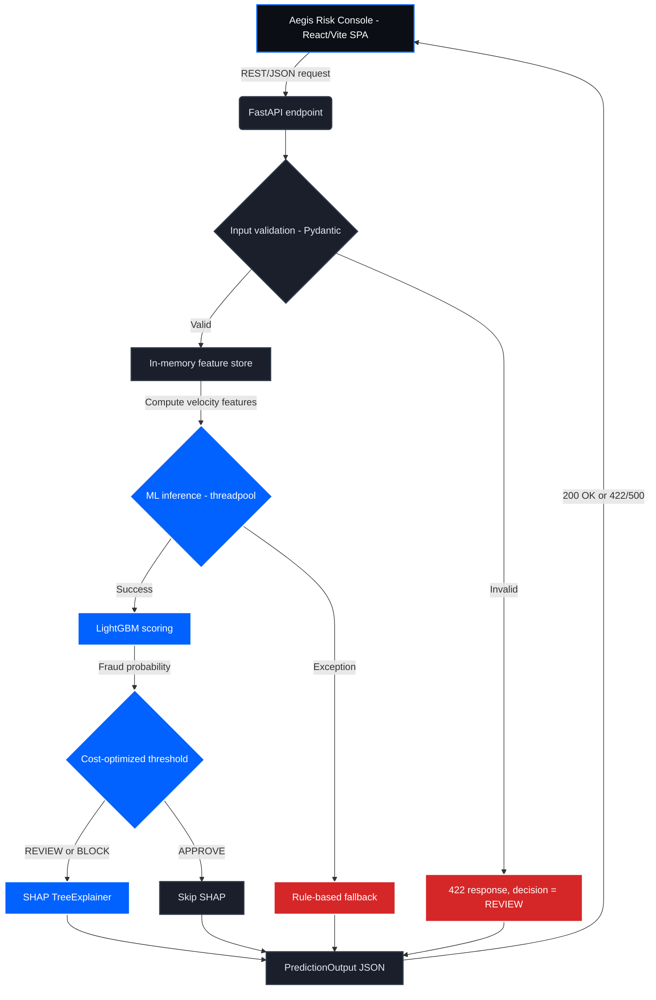

# AI Risk Manager

This project was built for the Razorpay AI Buildathon, Track 2 (AI Risk Manager). It's a machine learning system that scores individual credit card transactions for fraud risk in real time, exposed through a FastAPI backend and a separate React/Vite/TypeScript frontend (the Aegis Risk Console) for reviewing predictions.

Card transaction fraud produces two different kinds of financial loss: money lost to fraud that isn't caught, and revenue/customer trust lost from declining transactions that were actually legitimate. Instead of picking a decision threshold that treats both error types as equally costly (the usual default), this project selects its operating threshold using an explicit cost model, so the trade-off between the two is a deliberate choice rather than a side effect of a 0.5 cutoff.

Given a transaction, the system returns a fraud probability, a decision (APPROVE / REVIEW / BLOCK) based on that threshold, and — for transactions flagged REVIEW or BLOCK — a SHAP-based explanation of which features drove the prediction. The parts I think are worth reading closely: the cost-driven threshold selection, the velocity/geographic feature engineering done with chronological data handling to avoid leakage, and the layered failure handling that keeps the API responding when validation fails or the model itself throws an exception.

## Demo

**Screenshot:** _add a screenshot of the Aegis Risk Console (React frontend) here_

**Live demo link:** _add link here, if available_

## Key Results

Evaluation is performed on a held-out test set that the model did not see during training, validation, or threshold selection.

| Metric | Value |
| :--- | :--- |
| **APPROVE/REVIEW threshold** | 0.120 |
| **REVIEW/BLOCK threshold** | 0.850 |
| **Precision** | 82.77% |
| **Recall** | 95.43% |
| **PR-AUC** | 0.9695 |
| **ROC-AUC** | 0.9991 |
| **Held-out test set size** | 555,719 transactions |
| **False Positives** | 426 |
| **False Negatives** | 98 |
| **Estimated total loss (optimized)** | $23,977.77 (38.2% reduction) |

## Problem

Card transaction fraud creates two kinds of loss for a payments platform: money lost directly to fraud that isn't caught (chargebacks), and revenue or customer trust lost from declining transactions that were actually legitimate (false declines). A model optimized purely for accuracy or F1 at a 0.5 threshold treats both error types as equally expensive, which usually isn't true — for most merchants, missing real fraud is far more costly than an occasional unnecessary decline.

This project targets that second problem specifically: not just detecting fraud, but choosing a decision threshold that reflects an explicit (if simplified) cost trade-off between the two error types, rather than a threshold that happens to fall out of a generic classification metric.

## How It Works

1. A transaction is submitted as JSON — from the Aegis Risk Console (React/Vite frontend) or another client — to the FastAPI backend.
2. The payload is validated against a Pydantic schema.
3. If valid, recent transaction history for that cardholder is pulled from an in-memory feature store to compute velocity features.
4. LightGBM scores the transaction and produces a fraud probability.
5. The probability is compared against the 0.120 operating threshold to produce a decision (see Risk Decision Flow).
6. If the decision is REVIEW or BLOCK, a SHAP explanation is generated for that transaction.
7. The API returns the probability, decision, and (when applicable) the explanation as a single JSON response.

## Architecture

The frontend and backend are two separate applications that communicate over REST/JSON — there's no shared process or shared build. The diagram below shows the request path through validation, feature computation, model scoring, and the two failure-handling branches (validation errors and model exceptions).



### Backend (FastAPI)

The backend is a single FastAPI process handling validation, feature computation, model scoring, threshold logic, SHAP generation, and the rule-based fallback described in Resilience and Failure Handling.

### Frontend (Aegis Risk Console)

The frontend is a React + Vite + TypeScript SPA, styled with Tailwind CSS (a charcoal/slate color palette) and Shadcn UI components. It doesn't run any of the fraud-scoring logic itself — it calls the FastAPI backend and renders the result.

API responses are validated on the client with Zod. Both the success path (`200 OK`, an ML prediction) and the fallback path (`422`/`500`, the rules engine) are normalized into a single `RiskDecision` type before being rendered, so the rest of the UI doesn't need to branch on which path produced the decision. When `fallback_triggered` is `true` on that type, the UI hides the SHAP chart and probability metrics and shows the `decision.reason` string instead, making it visible that the rules engine — not the ML model — produced that particular decision.

The SHAP output for REVIEW/BLOCK decisions is rendered as a diverging bar chart using Recharts, showing which features pushed the probability up or down.

## Risk Decision Flow

The model outputs a fraud probability between 0 and 1 for each transaction. The system uses two thresholds rather than one, mapping that probability to three decisions:

- **APPROVE:** score below **0.120** — approved automatically.
- **REVIEW:** score between **0.120** and **0.850** — routed to a human analyst along with a SHAP explanation of the contributing features.
- **BLOCK:** score above **0.850** — treated as high-confidence fraud and declined automatically.

The lower threshold (0.120) is the cost-optimal cutoff derived from the cost sweep described below. The upper threshold (0.850) serves as a high-confidence boundary, separating ambiguous transactions that warrant manual review from cases confident enough to decline automatically.

## Machine Learning

**Dataset:** The model is trained on the synthetic Sparkov credit card transaction dataset, which simulates cardholders, merchants, and transactions with labeled fraud cases. It is not real transaction data.

**Velocity features:** `amt_sum_24h` (rolling sum of transaction amounts in the preceding 24 hours) and `txn_count_1h` (rolling count of transactions in the preceding 1 hour), computed per cardholder using only transactions that occurred earlier in time than the current one, so no future information leaks into a transaction's features.

**Geographic feature:** Haversine distance between the customer's and merchant's coordinates, computed from the latitude/longitude fields present in the dataset.

**Categorical encoding:** High-cardinality categorical fields (merchant, job, city) are frequency-encoded. The frequency statistics are computed on the training set only and then applied to the validation and test sets, so target information isn't used when building the encoding. This reduces, but doesn't fully eliminate, the risk of leakage through these features — a category that's strongly correlated with fraud rate across the whole dataset could still carry signal beyond its raw frequency.

**Model:** LightGBM (gradient-boosted decision trees).

**Chronological split and validation methodology:** Data is split into train, validation, and held-out test sets chronologically rather than with a random shuffle, since transactions are time-ordered and several features depend on prior transaction history. Hyperparameters and the decision threshold are tuned on a validation tail that comes strictly after the training period. The metrics in Key Results are computed on a separate held-out test set that isn't used for training or tuning.

## Cost Optimization

Instead of picking a threshold that maximizes F1 (the default 0.5 cutoff), I picked the threshold that minimizes total estimated cost under an explicit, asymmetric cost matrix:

- **False negative cost** = transaction amount + a $25 assumed chargeback fee.
- **False positive cost** = transaction amount × 0.02, representing an assumed lost interchange margin on a transaction that gets declined.

**Baseline:** the default model tuned for maximum F1-score, which uses the standard 0.5 threshold. At that threshold, the model correctly optimizes for overall classification accuracy, but ends up blocking a number of legitimate high-value transactions and missing high-value fraud that a cost-aware threshold catches.

**Result:** sweeping thresholds against this cost matrix on the held-out set shows that moving from the F1-optimal threshold (0.5) down to 0.120 reduces total estimated cost. This is why the 0.120 threshold trades away a small amount of precision (82.77%) to maximize recall (95.43%) — the cost formula makes a missed fraud transaction far more expensive than an unnecessary decline, so the search favors catching more fraud at the expense of more false alarms.

**What this means in practice:** at 0.120, the vast majority of transactions in the REVIEW/BLOCK range are genuine fraud risks. The threshold is set up for a screening workflow — REVIEW routes to a human analyst rather than an automatic decline — which is part of why the dual-threshold design (see Risk Decision Flow) reserves outright auto-blocking for scores above 0.850.

**Cost comparison**

| Strategy | FP Cost | FN Cost | Total Estimated Cost |
| :--- | :--- | :--- | :--- |
| **Baseline (F1-optimal, 0.5)** | amount × 0.02 | amount + $25 | ≈ $38,782.87 |
| **Optimized (threshold = 0.120)** | amount × 0.02 | amount + $25 | $23,977.77 ($14,805.10 saved) |

**These are model-based cost estimates under the assumptions above (a $25 flat chargeback fee, a 2% interchange margin) — not measured financial figures from Razorpay or a real merchant.**

## Ablation Test

To check whether the model is learning genuine behavioral signal (velocity, distance) rather than exploiting artifacts of how the synthetic dataset was generated — e.g., patterns tied to transaction hour or day of week — I retrained the model with all temporal identifiers removed and compared PR-AUC:

| Model Setup | PR-AUC |
| :--- | :--- |
| **Full model** | 0.9716 |
| **Without temporal identifiers** | 0.9202 |

The drop in PR-AUC suggests that the model retains substantial predictive signal even after removing temporal identifiers, which is evidence against the model relying entirely on time-based artifacts in the synthetic data. It isn't proof the model would generalize to real transaction data — the entire dataset, with or without temporal features, is still synthetic.

## Explainability

For decisions that come out as REVIEW or BLOCK, the API generates a SHAP explanation using a TreeExplainer on the LightGBM model, showing which features pushed the prediction up or down. For APPROVE decisions, SHAP is skipped.

I don't have a measured latency benchmark for how much this saves — the reasoning is simply that an explanation is only useful when a transaction might actually be reviewed by a person, so it isn't generated for every transaction.

On the frontend, this explanation is rendered as a diverging bar chart (see Frontend, under Architecture). When a decision comes from the rule-based fallback instead of the model, the UI hides this chart entirely rather than showing an explanation for a decision the model didn't actually make.

**Example output:** _add a sample SHAP chart (screenshot) here once available._

## Resilience and Failure Handling

The service is structured so a single bad request or a model failure doesn't take down the checkout flow it's protecting. There are three separate pieces:

1. **Input validation (Pydantic).** Incoming payloads are validated against a Pydantic schema before anything else runs. If validation fails — missing fields, negative amounts, wrong types — the API returns a 422 response and a REVIEW decision instead of a 500 error, along with a structured log of what failed. This is input validation, not a fallback; it's the standard way malformed requests are handled.

2. **Non-blocking ML inference.** LightGBM scoring and SHAP generation both run in a threadpool rather than directly on the FastAPI event loop, so a slow prediction doesn't block other concurrent requests.

3. **Rule-based fallback.** If the inference step raises an exception (missing model file, unexpected input shape, etc.), the API catches it and routes the transaction to `fallback_rules.py`, a small hardcoded rules engine — for example, blocking any unscored transaction over $5,000. This keeps the endpoint responding when the model itself is unavailable, using much cruder logic than the trained model.

4. **Client-side response validation.** The frontend validates every API response with Zod and normalizes both the success path and the fallback path into a single `RiskDecision` type. When a response indicates the fallback engine ran, the UI hides the SHAP chart and probability metrics and shows the fallback's reason string instead, so a fallback-produced decision is never presented as if it came from the model.

This doesn't make the backend highly available in the infrastructure sense — it runs as a single FastAPI process with an in-memory feature store and no redundancy or persistence. What it does provide is a defined behavior for two specific failure modes (bad input, model exceptions): each produces a safe, explicit decision instead of crashing the request, and the frontend is built to represent that decision honestly rather than papering over which path produced it.

## Limitations

- Trained and evaluated on the synthetic Sparkov dataset, not real transaction data — performance on real-world traffic is unknown.
- The feature store is in-memory, so recent transaction history resets on restart and isn't shared across multiple instances of the service.
- Precision at the selected 0.120 threshold is 82.77%. While highly accurate, the 17.23% false positive rate means some legitimate transactions are still flagged. The threshold is designed for a review/screening workflow to minimize financial loss, not for automatically blocking every flagged transaction without human oversight.
- The $25 chargeback fee and the 2% interchange-margin figure used in the cost model are assumptions I chose, not measured business figures from Razorpay.
- The frontend and backend are two separate codebases with no shared type definitions beyond what Zod validates at the API boundary — a backend response shape change isn't caught until the frontend's Zod schema fails to parse it.
- The rule-based fallback uses a small number of static, hardcoded rules (e.g., a flat $5,000 blocking threshold) that haven't been tuned or validated the way the ML model has.
- No latency or throughput benchmarks have been measured for the API or the SHAP explanation path.

## Running Locally

The backend and frontend are separate applications and need to run in two terminals at once.

```bash
git clone <your-repo-link>
cd Fraud_Detection_System
pip install -r requirements.txt
```

**Terminal 1 — backend:**

```bash
# From the root Fraud_Detection_System directory
python api\main.py
# Runs FastAPI/Uvicorn on http://127.0.0.1:8000
```

**Terminal 2 — frontend:**

```bash
cd aegis-risk-console
npm install
npm run dev
# Runs Vite on http://localhost:5173
```

## Project Structure

```
Fraud_Detection_System/
├── requirements.txt
├── api/
│   └── main.py                  # FastAPI app — run via `python api\main.py`
├── src/
│   ├── train.py                 # Model training pipeline
│   ├── threshold_optimizer.py   # Cost-based threshold selection
│   └── fallback_rules.py        # Rule-based fallback engine
└── aegis-risk-console/          # React/Vite/TypeScript frontend
```

## API Contract

The FastAPI backend exposes the scoring engine via a single REST endpoint.

**POST `/v1/predict-fraud`**

Request payload:

```json
{
  "amount": 249.99,
  "merchant": "fraud_Kutch_and_Sons",
  "category": "shopping_net",
  "merchant_lat": 40.7128,
  "merchant_long": -74.0060,
  "customer_lat": 34.0522,
  "customer_long": -118.2437,
  "dob": "1990-05-14",
  "trans_time": "2026-08-29T12:00:00"
}
```

Response payload (`200 OK`):

```json
{
  "is_fraud": false,
  "fraud_probability": 0.0012,
  "action_taken": "APPROVE",
  "shap_explanation": {},
  "threshold_used": 0.120,
  "fallback_triggered": false,
  "reason": null
}
```

## Future Improvements

- Persistent feature store (e.g., Redis or a database) instead of in-memory state, so velocity features survive restarts and work across multiple instances.
- Implement a dynamic cost-sweep for the upper 0.850 BLOCK threshold, similar to the 0.120 REVIEW threshold, rather than relying on a static high-confidence boundary.- Evaluation against real-world transaction data, since current results are based on the synthetic Sparkov dataset.
- Monitoring for concept drift — a static threshold and static fallback rules will degrade as transaction patterns change.
- Latency benchmarking for the SHAP explanation path and the overall request pipeline.
- A more structured review workflow for REVIEW-flagged transactions, rather than a binary approve/flag decision.
